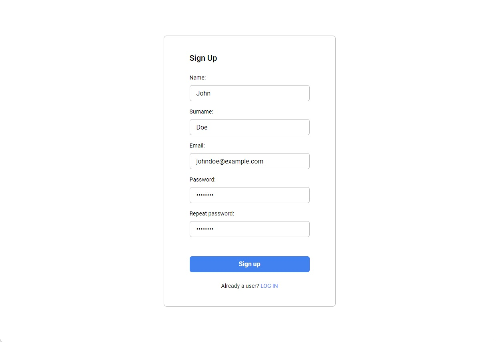
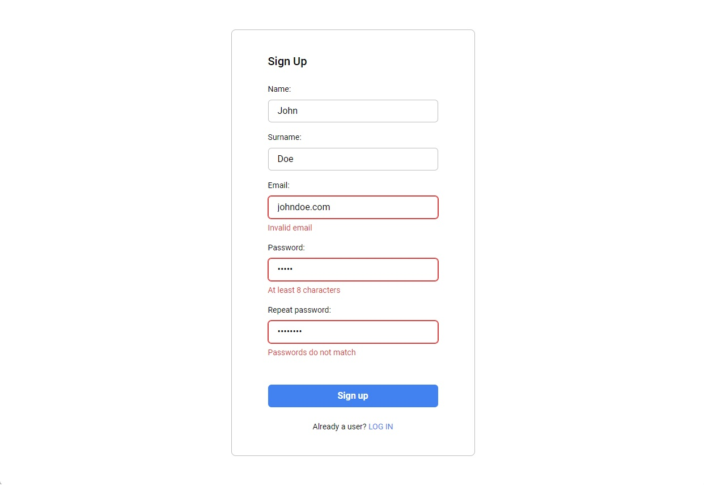
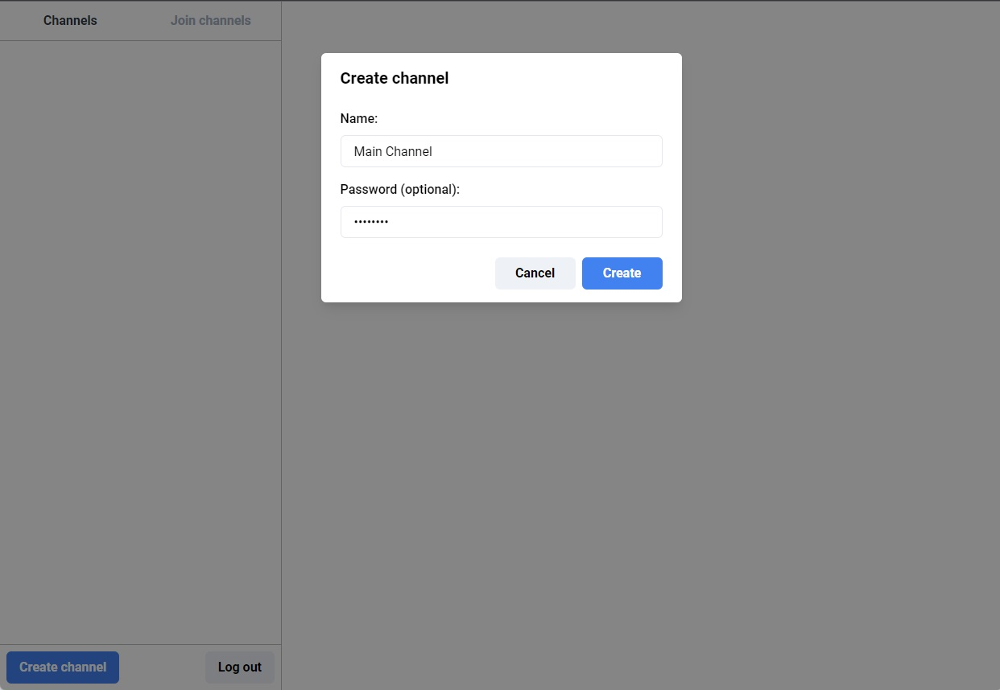
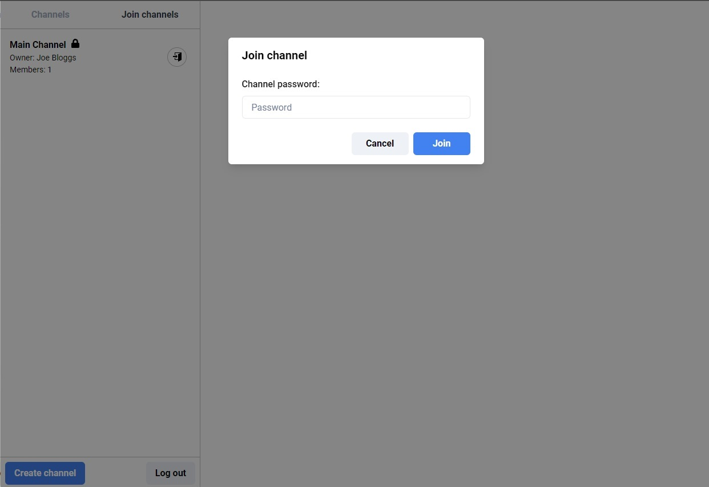
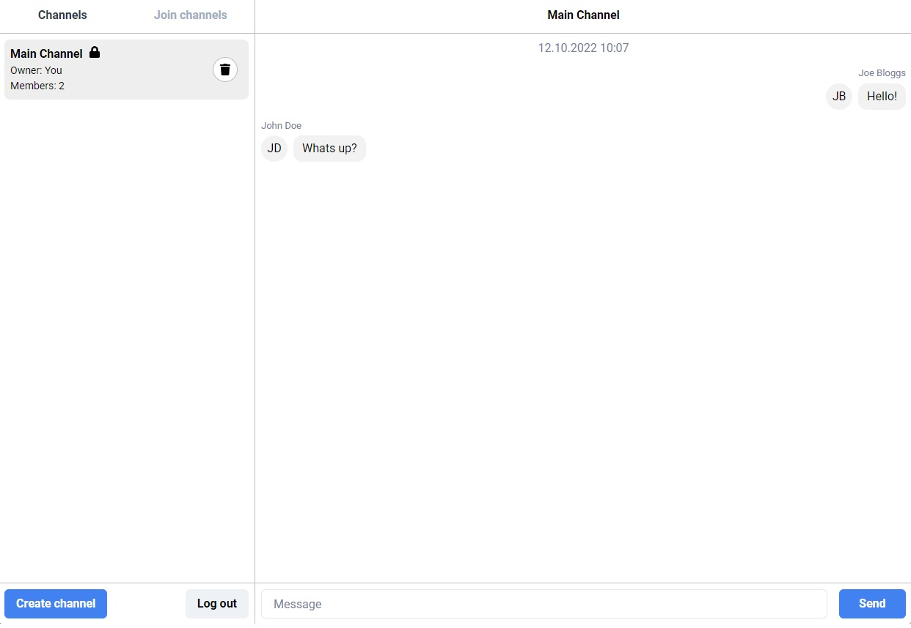

# Chat App

Chat application powered by NestJS, WebSockets, React and PostgreSQL.  
Provides functionality to create accounts and then group chats (channels) to chat with other users.

# Features

- Sign-Up / Log-In
- Create **public** or **password-protected** group chats (channels)
- Delete created channels
- Join and leave channels created by others
- Send messages and have others receive them in real time.
- Dockerized and ready to deploy with docker-compose
- Uses Nginx to serve frontend
- Uses HAProxy as a reverse-proxy
- Unit-tested backend
- Monorepo using yarn workspaces

# Stack

### Frontend

- TypeScript
- React
- Chakra-UI
- Zustand

### Backend

- TypeScript
- NestJS
- TypeORM
- WS
- Redis
- PostgreSQL
- Docker and docker-compose
- Nginx
- HAProxy

# Demo

## Sign-up



## Sign-up with validation errors



## Create channel



## Join channel



## Messaging



# Usage

To build and run this application you will need:

- docker
- docker-compose

```bash
# Clone this repository
$ git clone https://github.com/mstopin/chat-app

# Open the project directory
$ cd chat-app

# go to docker/env directory
# rename *.example.env files to *.env
# type in empty secrets

# Build docker images
$ docker-compose build

# Run the app
$ docker-compose up
```

# License

MIT
